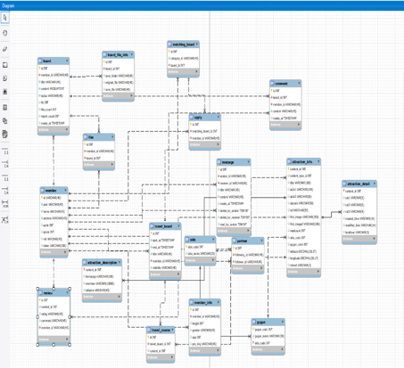

# ✈️ TL

> **여러 사람들과 여행지를 공유하고 추천받아보아요!**
>

# 🧑🏻‍💻 프로젝트 및 멤버

> 기간: 2024.5.16 ~ 2024.5.23
>

> 멤버 구성: 2명(Back-end & Front-end)
>

## 프로젝트 소개

여행 정보 플랫폼 **TL(Travel link)은** 여행 계획 수립을 통해 해당 계획을 커뮤니티를 통해 다른 사용자들과 공유를 할 수 있는 여행 공유 커뮤니티 플랫폼입니다!

- 여행, 맛집등 리뷰를 작성하여 조회수와 좋아요를 얻어보아요!
- 지도를 활용하여 여행코스를 등록하고  조회수와 좋아요를 얻어보아요!
- AI 추천 서비스를 통해 새로운 여행코스를 추천받아보아요!
- 팔로우 기능을 통해 여러 사람들의 여행 코스를 둘러보아요!
- 일정 포인트를 얻어서 랭킹을 올려보아요!

> **[기술 스택](#기술-스택)**
>
> **[서비스 시연영상](#서비스-시연-영상)**

---

## 기술 스택

### Frontend

### Backend

### 협업 툴

---

## ERD

---

## 서비스 시연 영상

 <a href="https://www.youtube.com/watch?v=rdK-MkZQznk" style="font-size:2em;">시연영상 유튜브 링크</a> 

---

---  
